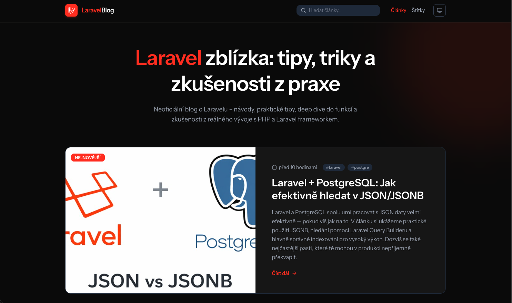

# Laravel Blog

A modern production-ready blog application built with Laravel 12, Inertia.js v2, Vue 3, and Tailwind CSS v4.

**Maintained by:** [Vladislav Rajtmajer (@rajtik76)](https://github.com/rajtik76)

**Live Demo:** [https://laravel-blog.cz](https://laravel-blog.cz)

## 🖼️ Preview




## 🚀 Technical Stack


[](https://github.com/rajtik-laravel-blog/laravel-blog/actions/workflows/tests.yml)


- **Database:** [PostgreSQL](https://www.postgresql.org) / [SQLite](https://www.sqlite.org) (dev)
- **Backend:** [Laravel 12](https://laravel.com)
- **Frontend:** [Inertia.js v2](https://inertiajs.com), [Vue 3](https://vuejs.org), [Tailwind CSS v4](https://tailwindcss.com)
- **Authentication:** [Laravel Fortify](https://laravel.com/docs/fortify)
- **Search:** [Laravel Scout](https://laravel.com/docs/scout)
- **Testing:** [Pest 4](https://pestphp.com)
- **Tooling:** [Laravel Wayfinder](https://github.com/laravel/wayfinder), [Laravel Boost](https://github.com/laravel/boost), [Laravel Pint](https://laravel.com/docs/pint)

## Features

- **Blog Engine:** Browse posts, filter by tags, and read detailed content.
- **Author Dashboard:** Secure area for authors to create, edit, and manage their posts.
- **Publishing Workflow:** Toggle post visibility with a publishing system.
- **Full-Text Search:** Integrated search functionality using Laravel Scout.
- **Modern UI:** Built with Tailwind CSS v4 for a clean, responsive experience.
- **TypeScript Integration:** Leverages Laravel Wayfinder for type-safe routing in the frontend.

## Getting Started

### Prerequisites

- PHP 8.4 or higher
- Node.js & NPM
- Composer

### Installation

1. **Clone the repository:**
   ```bash
   git clone <repository-url>
   cd laravel-blog
   ```

2. **Install dependencies:**
   ```bash
   composer install
   npm install
   ```

3. **Set up environment:**
   ```bash
   cp .env.example .env
   php artisan key:generate
   ```

4. **Configure database:**
   Update the `.env` file with your database credentials. By default, the project is configured for SQLite.
   ```bash
   touch database/database.sqlite
   php artisan migrate --seed
   ```

5. **Run development servers:**
   ```bash
   composer run dev
   ```
   This command starts both the Laravel server and the Vite development server using `concurrently`.

## Development

- **Formatting:** Use Laravel Pint to maintain code style:
  ```bash
  composer run lint
  ```
- **Testing:** Run the test suite using Pest:
  ```bash
  composer run test
  ```
- **Routing:** Frontend routes are generated by Wayfinder. If you add new routes, they will be automatically updated in the TypeScript definitions.

## License

This project is open-sourced software licensed under the [MIT license](https://opensource.org/licenses/MIT).
